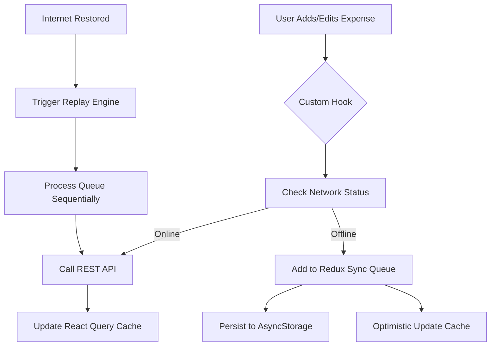

# Expense Tracker App (Offline-First)

A feature-rich, offline-first mobile application built with **React Native** and **TypeScript** for managing personal expenses. The app focuses on high reliability in low-connectivity areas through a custom background synchronization engine.

## 🏗 Architecture Overview

The application follows a **Modular Layered Architecture** with an **Offline-First** mindset, ensuring that users can always interact with their data regardless of internet availability.

### High-Level Architecture

1.  **UI Layer (React Native)**: Handles user interaction and screen rendering.
2.  **State Management (Redux Toolkit)**: Manages global client-side state, specifically network status and the offline mutation queue.
3.  **Server State (TanStack Query)**: Handles data fetching, caching, and optimistic UI updates for a smooth user experience.
4.  **Synchronization Layer (Custom Queue)**: A specialized engine that intercepts API calls when offline, persists them to local storage, and replays them when connectivity is restored.

### 🔄 Data Flow (Offline Sync)



---

## 📂 Project Structure

```text
src/
├── api/          # Axios instance and API service definitions
├── components/   # Atomic UI components and shared layouts
├── constants/    # App-wide constants (Query Keys, Action Types)
├── db/           # Local dev database (json-server)
├── hooks/        # Custom React hooks (Business logic & Mutations)
├── providers/    # Context providers (QueryClient, Redux)
├── queue/        # Offline sync engine (Queue Management & Replay logic)
├── screens/      # Main application screens
├── store/        # Redux Toolkit configuration, slices, and persistence
├── types/        # TypeScript interfaces and types
└── utils/        # Helper functions (Formatting, Validation)
```

---

## 🛠 Technical Stack

- **Framework**: [React Native](https://reactnative.dev/) (v0.84)
- **Language**: [TypeScript](https://www.typescriptlang.org/)
- **Navigation**: [React Navigation](https://reactnavigation.org/)
- **State Management**: [Redux Toolkit](https://redux-toolkit.js.org/)
- **Data Synchronization**: [Redux Persist](https://github.com/rt2zz/redux-persist)
- **Data Fetching**: [TanStack Query (React Query)](https://tanstack.com/query/latest)
- **Backend (Dev)**: [json-server](https://github.com/typicode/json-server)
- **Networking**: [Axios](https://axios-http.com/)
- **Connectivity**: [@react-native-community/netinfo](https://github.com/react-native-netinfo/react-native-netinfo)

---

## 🚀 Getting Started

### Prerequisites

- Node.js (>= 22.11.0)
- React Native development environment (CocoaPods for iOS, Android SDK for Android)

### Step 1: Install Dependencies

```sh
npm install
cd ios && pod install && cd ..
```

### Step 2: Start the Mock Server

In a separate terminal, start the JSON server which acts as the backend:

```sh
npm run server
```

### Step 3: Start the App

```sh
# Start Metro bundler
npm start

# Run on Android
npm run android

# Run on iOS
npm run ios
```

---

## 🧩 Key Implementation Details

### Offline Sync Strategy

Every mutation (create/update/delete) is wrapped in a custom hook that checks the `isOnline` flag from the Redux state.

- **When Offline**: The action is dispatched to `offlineQueueSlice`, which is persisted in `AsyncStorage`.
- **Global Listener**: `index.tsx` contains a `NetInfo` listener that triggers `replayQueue()` as soon as the device regains internet access.
- **Optimistic Updates**: Using TanStack's `onMutate`, the UI updates instantly even before the sync queue finishes, giving a snappier feel.

### Redux Persistence

Only the `offlineQueue` is whitelisted for persistence, ensuring that we don't bloat local storage with transient UI state but never lose a user's local changes.
